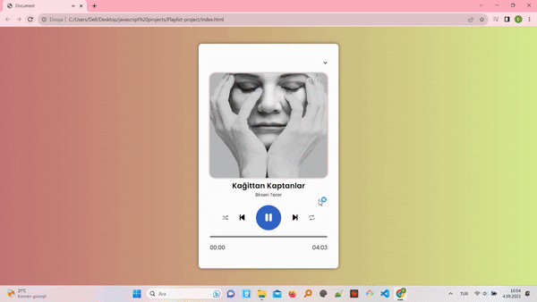

<h2>The name of the project</h2>

JavaScript-Playlist-Project

<h3>The aim of the project</h3>

The JavaScript Playlist Project is a web application that allows users to create and manage playlists of their favorite songs. It is built using JavaScript and provides a user-friendly interface for changing, shuffling and repeating song.

<h4> The technologies used </h4>

Html, Css and Javascript

<h5>The screen of the project</h5>

